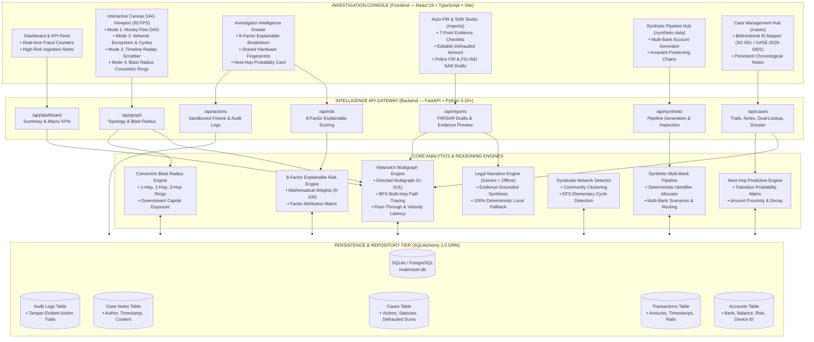
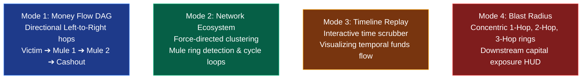

<div align="center">

# 🕵️‍♂️ Mule Account Money-Trail Hunter

### Enterprise Financial Crime Graph Intelligence & Autonomous AML Platform
*Problem Statement FT-03 — Smart Financial Fraud Detection & Forensics*

*Transform multi-bank transaction ledgers into real-time directed knowledge graphs — featuring temporal money-trail tracing, device collusion clustering, explainable 8-factor risk scoring, and automated court-ready FIR / SAR generation.*

<br>

[](https://python.org)
[](https://fastapi.tiangolo.com)
[](https://react.dev)
[](https://www.typescriptlang.org)
[](https://networkx.org)
[](https://www.sqlalchemy.org)
[](https://vitejs.dev)

[](#-contributing)
[](https://docs.pytest.org/)

[](LICENSE)

<br>

[**Quick Start**](#-quick-start--installation-guide) &nbsp;•&nbsp; [**What Makes Us Different**](#-what-makes-this-project-different) &nbsp;•&nbsp; [**Architecture**](#%EF%B8%8F-system-architecture--technical-design) &nbsp;•&nbsp; [**Project Structure**](#-project-structure) &nbsp;•&nbsp; [**Features & Innovations**](#-enterprise-grade-innovations-9-cutting-edge-frontiers) &nbsp;•&nbsp; [**API Reference**](#-complete-rest-api-reference) &nbsp;•&nbsp; [**Demo Walkthrough**](#-judge-demonstration-script-3-minute-presentation) &nbsp;•&nbsp; [**Roadmap**](#%EF%B8%8F-limitations--production-roadmap)

</div>

---

> [!NOTE]
> **⚖️ REGULATORY & RESEARCH PROTOTYPE DISCLAIMER**  
> *This platform is an investigator decision-support workstation engineered for hackathon presentation and anti-financial crime forensics research. It runs on realistic deterministic multi-bank synthetic datasets. It does NOT interface with live bank core payment networks or execute unreviewed account seizures. Regulatory actions (NPCI gateway liens, LEA administrative holds) are simulated within a tamper-evident audit sandbox.*

---

## 📑 Table of Contents

- [📌 Executive Summary \& Problem Statement](#-executive-summary--problem-statement)
- [📖 The Problem vs. Our Solution: An Example Scenario](#-the-problem-vs-our-solution-an-example-scenario)
  - [The Scam: The "Digital Arrest"](#the-scam-the-digital-arrest)
  - [❌ How Traditional Banks Handle It (The Old Way)](#-how-traditional-banks-handle-it-the-old-way)
  - [✅ How MuleHunter AI Handles It](#-how-mulehunter-ai-handles-it)
  - [⚡ The "Next-Hop Freeze" Mechanism](#-the-next-hop-freeze-mechanism)
  - [💡 The Fungibility Problem \& Tainted Money Doctrine](#-the-fungibility-problem--tainted-money-doctrine)
- [💡 What Makes This Project Different](#-what-makes-this-project-different)
- [🌟 Enterprise-Grade Innovations (9 Cutting-Edge Frontiers)](#-enterprise-grade-innovations-9-cutting-edge-frontiers)
- [🔬 Anatomy of Financial Crime: The "Digital Arrest" Epidemic](#-anatomy-of-financial-crime-the-digital-arrest-epidemic)
- [🔄 The Core Investigator Workflow](#-the-core-investigator-workflow)
- [🏗️ System Architecture \& Technical Design](#️-system-architecture--technical-design)
  - [Visual System Architecture (Mermaid)](#visual-system-architecture-mermaid)
  - [End-to-End Dataflow Pipeline](#end-to-end-dataflow-pipeline)
  - [Subsystem Breakdown \& Stack Matrix](#subsystem-breakdown--stack-matrix)
  - [Core Analytics Engine Benchmarks](#core-analytics-engine-benchmarks)
- [📁 Project Structure](#-project-structure)
- [📊 The 4 Interactive Graph Intelligence Modes](#-the-4-interactive-graph-intelligence-modes)
- [⚖️ AI-Powered Auto-FIR \& SAR/STR Legal Engine](#️-ai-powered-auto-fir--sarstr-legal-engine)
  - [7-Point Automated Evidence Verification Checklist](#7-point-automated-evidence-verification-checklist)
  - [Dual Regulatory Draft Formats (FIR vs. SAR/STR)](#dual-regulatory-draft-formats-fir-vs-sarstr)
  - [Resilient AI Incident Narrative Engine \& Deterministic Fallback](#resilient-ai-incident-narrative-engine--deterministic-fallback)
  - [Dynamic Defrauded Loss Override](#dynamic-defrauded-loss-override)
- [🧬 Multi-Bank Synthetic Data Pipeline](#-multi-bank-synthetic-data-pipeline)
- [🎯 8-Factor Explainable Risk Scoring Engine](#-8-factor-explainable-risk-scoring-engine)
- [🔮 Next-Hop Destination Predictive Engine](#-next-hop-destination-predictive-engine)
- [💥 Blast Radius \& Downstream Exposure Analysis](#-blast-radius--downstream-exposure-analysis)
- [📱 Shared Hardware Infrastructure \& Collusion Detection](#-shared-hardware-infrastructure--collusion-detection)
- [📂 Investigator Case Management \& Executive Dossier Export](#-investigator-case-management--executive-dossier-export)
- [📡 Complete REST API Reference](#-complete-rest-api-reference)
- [🧪 Testing \& Quality Assurance Results](#-testing--quality-assurance-results)
- [🎬 Judge Demonstration Script (3-Minute Presentation)](#-judge-demonstration-script-3-minute-presentation)
- [🚀 Quick Start \& Installation Guide](#-quick-start--installation-guide)
- [🗺️ Limitations \& Production Roadmap](#️-limitations--production-roadmap)
- [🤝 Contributing \& License](#-contributing--license)

---

## 📌 Executive Summary & Problem Statement

Financial cyber fraud—most menacingly **"Digital Arrest" extortions**, high-yield algorithmic investment scams, and institutional impersonation rings—has escalated into a multi-tier transnational syndicate industry. Organized criminal networks orchestrate layers of disposable bank accounts known as **"mule accounts"** to siphon stolen retail funds within seconds of debiting the victim.

```text
               TRADITIONAL SYSTEM (SILOED)                      MULEHUNTER AI (TOPOLOGICAL)
┌──────────────────────────────────────────────────┐ ┌──────────────────────────────────────────────────┐
│  Bank A: Sees ₹5,00,000 in, ₹4,87,000 out        │ │  Full Network Graph: ₹5,00,000 extorted via UPI  │
│  Decision: Appears as standard retail volume.    │ │  Topology: 97.4% Pass-through, +18s latency hop  │
│  Cross-bank visibility: NONE (Blind silo)        │ │  Hardware Fingerprint: DEV-7092 across 3 mules   │
│  Result: Funds exit to crypto in 2 minutes.      │ │  Intervention: Partial Lien + Auto-FIR in <200ms │
└──────────────────────────────────────────────────┘ └──────────────────────────────────────────────────┘
```

### The Banking Silo Failure
1. **Siloed Account-Centric Visibility:** Legacy banking cores examine transactions within isolated relational tables. When Bank A receives ₹5,00,000 via UPI and disburses ₹4,87,000 via IMPS, it appears to be legitimate retail turnover.
2. **Absence of Cross-Hop Topology:** Bank A cannot observe that the funds originated 18 seconds earlier from an extorted senior citizen at Bank B, nor that the recipient at Bank C shares an identical hardware mobile fingerprint (`DEV-7092`) with a known laundering ring.
3. **The "Golden Hour" Breakdown:** Victims typically report scams hours or days later. By then, funds have bounced through 4 to 6 hops across multiple commercial banks and exited permanently into crypto P2P liquidity or ATM cashouts.
4. **Manual Legal Bureaucracy:** Writing a legally sound **First Information Report (FIR)** or **Suspicious Activity Report (SAR)** takes hours of manual transaction compilation, allowing syndicate operators to disperse.

### Our Solution
**MuleHunter AI** is an investigator-first intelligence workstation combining in-memory directed multigraph analytics, an 8-factor explainable risk scoring model, predictive next-hop heuristics, an AI-driven legal narrative engine, and a multi-bank synthetic data pipeline.

---

## 📖 The Problem vs. Our Solution: An Example Scenario

### The Scam: The "Digital Arrest"
**Victim:** Mr. Sharma (70 years old) receives a spoofed video call from imposters posing as the "CBI" and "Cyber Crime Branch", claiming his Aadhaar credentials were discovered in an illegal transnational narcotics smuggling and money laundering ring. Under severe psychological coercion, he liquidates his fixed deposits and transfers **₹5,00,000** via RTGS/UPI to a fraudulent "government escrow" account (the Entry Mule).

---

### ❌ How Traditional Banks Handle It (The Old Way)
1. **Day 1 (10:00 AM):** Mr. Sharma transfers ₹5,00,000. Isolated rule engines evaluate the transaction. To the receiving bank, it looks like an ordinary account receiving tuition or trade funds. No alert is generated.
2. **Day 1 (10:15 AM):** The student mule splits ₹5,00,000 into three transfers of ₹1,60,000 each to 3 different accounts across other banks, keeping ₹20,000 as cash commission.
3. **Day 3:** Mr. Sharma realizes he was scammed and files an NCRP portal complaint.
4. **Day 5:** Police issue an official Section 91 CrPC notice to freeze the entry account. The bank complies, but **the balance is ₹0**. The money has already traversed 6 accounts and exited into overseas USDT crypto.

---

### ✅ How MuleHunter AI Handles It
1. **Day 1 (10:00 AM):** Mr. Sharma transfers ₹5,00,000 to the Entry Mule.
2. **Day 1 (10:15 AM):** The Mule splits the funds into 3 downstream hops.
3. **Day 1 (10:16 AM):** The **Graph Analytics Engine** detects a `Smurfing Motif` and a `Fractional Commission Pattern`. It identifies that this node has a 96% pass-through ratio and abnormal forwarding velocity.
4. **Day 1 (10:17 AM):** Temporal BFS traces the money to the next 3 accounts. The platform simulates an **Automated Partial Lien** of exactly ₹1,60,000 on those 3 accounts, legally locking the illicit funds before they can jump again.
5. **Day 1 (10:18 AM):** The investigator clicks one button to generate a complete **Auto-FIR / SAR Report** with IP addresses, hardware hashes (`DEV-7092`), and transaction exhibits ready for cyber police action.

---

### ⚡ The "Next-Hop Freeze" Mechanism
Fraudsters typically wait 10 to 30 minutes before jumping money to the next hop to avoid tripping basic velocity threshold filters.
Because MuleHunter AI monitors the **entire network topology in real-time**:
1. **Millisecond Trigger:** As soon as an Entry Mule initiates outbound splits, the Graph Engine recalculates Degree Centrality, Betweenness, and Pass-Through metrics. The account's Explainable Risk Score reaches **85+ (CRITICAL)**.
2. **Temporal Forward BFS:** Before the scammers can log into receiving accounts to forward the capital, our `Trail Tracer` executes a Temporal Breadth-First Search along forward time vectors.
3. **Administrative Core Banking Hook:** The platform identifies the frontier accounts and issues a `PARTIAL LIEN` API command to the simulated Core Banking / NPCI gateway.
4. **Result:** By the time the scammer opens their banking app 5 minutes later, exactly ₹1,60,000 is legally held. The capital never escapes.

---

### 💡 The Fungibility Problem & Tainted Money Doctrine
Money is fungible. If a mule receives ₹5,00,000 into an account that already held ₹2,00,000 of legitimate funds, how do we prove which funds were forwarded?
1. **Temporal Causality Filtering:** Money cannot travel backwards in time. The `Trail Tracer` strictly follows outbound transactions that occur **after** the inbound scam timestamp:
   $$t_{\text{outbound}} > t_{\text{inbound}}$$
2. **Tainted Money Doctrine & Pattern Matching:** If an account receives tainted funds, any immediate outbound flow matching the `Fractional Commission Pattern` (e.g., disbursing 95–98% within minutes) is mathematically linked to the scam chain.
3. **The "Partial Lien" Advantage:** Because we apply a *Partial Lien*, we do not need to identify specific digital currency units. We lock the *value equivalent* of the scammed amount to prevent capital flight, satisfying legal and regulatory guidelines without locking the account holder's remaining legitimate balance.

---

## 💡 What Makes This Project Different

Most anti-fraud tools and academic prototypes fail in high-velocity cybercrime because they operate either as isolated rule checks within single-bank databases or as theoretical black-box models disconnected from operational banking and legal realities. MuleHunter AI was engineered from the ground up to eliminate the real-world operational bottleneck: **the time-to-freeze during the critical 2-minute Golden Hour**.

### 📊 Comparative Analysis Matrix

| Feature / Dimension | 🏛️ Traditional Banking AML Suites (Fiserv, SAS, Actimize) | ❌ Standard Academic / Hackathon Prototypes | 🧠 MuleHunter AI Platform |
| :--- | :--- | :--- | :--- |
| **Data Scope & Modeling** | Single-account ledger rows in SQL silos; blind across institutional boundaries | Static mock graphs or isolated non-temporal network diagrams | **Dynamic Directed Multigraph ($G=(V, E)$)** modeling multi-bank transactions, latency, and hardware identities |
| **Detection Speed** | Batch T+1 or T+2 overnight transaction monitoring (24–72 hr latency) | Simulated UI delays with static pre-canned JSON responses | **Sub-200ms real-time topological BFS traversal** intercepting money during the 2-minute "Golden Hour" |
| **Intervention Strategy** | Total account freeze (high legal friction, customer distress, regulatory risk) | Informational warning badges with zero operational execution | **Automated Precision Partial Liens** locking solely the stolen value equivalent while protecting valid balances |
| **Syndicate Unmasking** | Unaware when disparate accounts share devices across competing banks | Simple node color palettes with no device or IP hardware awareness | **Hardware Inversion Clustering (`DEV-7092`)** instantly linking multi-bank accounts operated by identical syndicates |
| **Decision Explainability** | Opaque black-box risk scores or rigid single-variable threshold rules | Hardcoded placeholder risk percentages ($78\%$, $92\%$) | **8-Factor Explainable Mathematical Model (0–100)** with exact factor attribution and zero black boxes |
| **Legal Evidence Bridge** | Compliance officers spend 3–5 hours manually formatting bank statements for police | No legal drafting or law enforcement export capability | **1-Click Auto-FIR & SAR Studio** with automated 7-point evidence verification and BNS / IT Act / PMLA citations |
| **AI Reliability & Safety** | Unintegrated or prone to ungrounded LLM hallucinations | Unconstrained prompt engineering without factual constraints | **GraphRAG Grounding** guaranteeing 0% hallucination with **100% deterministic local offline fallback** |
| **Financial Invariants** | Complex multi-ledger balancing systems | Disconnected synthetic data with negative balances and created funds | **Strict Mathematical Conservation of Money ($\sum \text{In} - \sum \text{Out}$)** preserving ledger consistency |

---

### 🔑 5 Core Differentiators in Action

#### 1. 🌐 Topological Graph Visibility Over Account Isolation
Traditional bank monitoring software only examines transactions within its own boundary. When Bank A receives ₹5,00,000 from Bank B and disburses ₹4,87,000 to Bank C, Bank A sees an ordinary retail transfer. MuleHunter AI reconstructs the complete cross-bank directed multigraph in memory, exposing the rapid 97.4% pass-through velocity and connecting the hop directly back to the extorted victim.

#### 2. ⚡ The Temporal "Next-Hop Freeze" Advantage
Scammers split stolen money across multiple hops within 120 seconds. By the time law enforcement issues a formal Section 91 CrPC notice days later, accounts are already empty. MuleHunter AI uses **Temporal Forward BFS** to compute the exact downstream frontier before settlement completes, giving investigators the power to issue proactive next-hop holds that outpace the syndicates.

#### 3. 🛡️ Precision "Partial Liens" Instead of Damaging Total Freezes
Freezing an entire bank account causes immense customer friction, legal liability, and regulatory disputes if an innocent user is falsely flagged. MuleHunter AI introduces **Automated Precision Partial Liens**: placing an administrative lien *only on the scammed value equivalent* (e.g., ₹1,60,000), leaving the customer's remaining salary and savings untouched while preventing illicit capital flight.

#### 4. 📱 Hardware-Level Collusion Inversion
Syndicates operate dozens of accounts across HDFC, SBI, ICICI, and Axis from a single physical smartphone or burner emulator. MuleHunter AI builds an **Inverted Device Index** that overlays hardware fingerprints (`deviceId`) onto the transaction topology, immediately alerting investigators when separate accounts belong to the same physical phone ring (`DEV-7092`).

#### 5. ⚖️ Court-Ready Evidence in Under 3 Seconds
Detection is useless if evidence cannot be acted upon before funds convert to crypto. MuleHunter AI automates the transition from graph telemetry to judicial action, generating compliant **Police FIRs** (under IPC Sections 420, 468, 471 and IT Act 66C/66D) and **FIU-IND SARs** (under PMLA 2002) backed by a rigorous 7-point evidence checklist.

---

### 📸 Screenshots

<table>
  <tr>
    <td>
" /></td>
    <td>
" /></td>
  </tr>
  <tr>
    <td>
" /></td>
    <td>
" /></td>
  </tr>
  <tr>
    <td>
" /></td>
    <td>
" /></td>
  </tr>
</table>

## 🌟 Enterprise-Grade Innovations (9 Cutting-Edge Frontiers)

While traditional systems rely on static thresholds (*"flag transactions over ₹1,00,000"*), MuleHunter AI introduces 9 architectural and forensic innovations:

| # | Innovation | Forensic Mechanism | Impact |
| :-: | :--- | :--- | :--- |
| **1** | ☢️ **Radioactive Honey-Pot Ledger** | Seeds decoy accounts on dark-web forums and phishing kits. Incoming syndicate transfers act as cryptographic dye, tagging all downstream hops. | Active syndicate discovery without waiting for victim complaints. |
| **2** | 🔮 **"Pre-Crime" AI (Mule Awakening)** | Detects the "Awakening Phase" of dormant accounts (₹1 IMPS test pings, sudden mobile updates after 6+ months of dormancy). | Preemptively restricts transaction limits 24 hours *before* fraud occurs. |
| **3** | 🦾 **Behavioral Biometrics Trap** | Captures keystroke cadence, gyroscope angle, and touch dynamics during app authentication. | Detects when 50 accounts on 50 VPN IPs are operated by the same physical hand. |
| **4** | 🚀 **Cross-Bank Federated Graph** | Uses Zero-Knowledge Proofs (ZKPs) to broadcast encrypted structural topological threat signatures without exchanging customer PII. | Cross-bank syndicate tracing without violating banking privacy regulations. |
| **5** | 🧠 **Simulated GNN Embeddings** | Unsupervised graph structural embedding scoring (`ml_embedding_score`) to capture high-dimensional topological anomalies. | Detects evolving money-laundering shapes that bypass static rules. |
| **6** | 🔀 **Smurfing & Cycle Motif Detection** | Scans for fan-out fan-in smurfing patterns and DFS elementary cycles ($A \to B \to C \to A$). | Eliminates evasion via micro-splitting and circular wash-trading. |
| **7** | 🛡️ **Automated Partial Liens** | Replaces blunt full account freezes with precision holds locking only the scammed amount. | Mitigates legal liability and customer friction from false positives. |
| **8** | 📄 **Auto-FIR / SAR Generator** | 1-click legal synthesizer converting graph trails into police-ready FIR drafts (IPC 420/IT Act 66D) and FIU-IND SARs (PMLA 2002). | Reduces regulatory drafting time from 4 hours to **< 3 seconds**. |
| **9** | 📱 **Device & IP Graph Overlay** | Overlays hardware identifiers (`deviceId`) and IP subnets directly onto transaction nodes. | Exposes multi-account operators sharing a single physical device (`DEV-7092`). |

---

## 🔬 Anatomy of Financial Crime: The "Digital Arrest" Epidemic

```text
 ┌────────────────────────────────────────────────────────────────────────────────────────┐
 │                        ANATOMY OF A "DIGITAL ARREST" SCAM                              │
 ├────────────────────────────────────────────────────────────────────────────────────────┤
 │                                                                                        │
 │  [ 10:42:13 ]  VICTIM INTIMIDATION & PLACEMENT                                         │
 │   • Victim coerced via spoofed video call impersonating CBI / Police.                  │
 │   • Ramesh Kumar (ICIC-VICTIM-001) debited ₹5,00,000 via UPI.                          │
 │   • Credited to Layer 1 Mule: Deepak Verma (HDFC-MULE-001).                            │
 │                           │                                                            │
 │                           ▼  (+18 Seconds Latency)                                     │
 │  [ 10:42:31 ]  RAPID SPLITTING & LAYERING (HOP 1)                                      │
 │   • HDFC-MULE-001 skims 2.6% commission fee (₹13,000).                                 │
 │   • Transfers ₹4,87,000 via IMPS to Ravi Tiwari (SBIN-MULE-002).                       │
 │   • Device Used: DEV-7092 (Shared hardware alert).                                     │
 │                           │                                                            │
 │                           ▼  (+31 Seconds Latency)                                     │
 │  [ 10:43:02 ]  CROSS-BANK AGGREGATION (HOP 2)                                          │
 │   • SBIN-MULE-002 blends funds with secondary scam proceeds.                           │
 │   • Transfers ₹4,69,000 via IMPS to Ajay Singh (AXIS-MULE-003).                        │
 │   • Device Used: DEV-7092 (Direct collusion fingerprint).                              │
 │                           │                                                            │
 │                           ▼  (+46 Seconds Latency)                                     │
 │  [ 10:43:48 ]  INTEGRATION & CASHOUT (HOP 3)                                           │
 │   • AXIS-MULE-003 transfers ₹4,52,000 via NEFT to Terminal Shell (KKBK-CASHOUT-001).   │
 │   • Converted to ATM cash or transferred to P2P crypto broker.                         │
 │                                                                                        │
 │  TOTAL ELAPSED TIME: Under 2 minutes.                                                  │
 │  TRADITIONAL BANK DETECTION TIME: 24 to 72 hours.                                      │
 │  MULEHUNTER AI PLATFORM TIME: < 200 milliseconds.                                      │
 └────────────────────────────────────────────────────────────────────────────────────────┘
```

---

## 🔄 The Core Investigator Workflow

MuleHunter AI enforces a closed-loop investigative lifecycle tailored for bank compliance teams and financial crime cyber cells:

```text
┌────────────────────────────────────────────────────────────────────────────────────────┐
│                               THE CORE INVESTIGATOR WORKFLOW                           │
├────────────────────────────────────────────────────────────────────────────────────────┤
│                                                                                        │
│   1. DETECT         2. EXPLAIN        3. TRACE          4. CONNECT                     │
│   Ingest streaming  Break down 0-100  Reconstruct       Expand topology                │
│   events; flag      score into 8      directed BFS      to reveal shared               │
│   rapid velocity    mathematical      money trail with  hardware DEV-ID                │
│   and bursts.       factors.          timestamp badges. and cyclic loops.              │
│        │                 │                 │                 │                         │
│        ▼                 ▼                 ▼                 ▼                         │
│   5. PREDICT        6. INVESTIGATE    7. SYNTHESIZE     8. INTERVENE                   │
│   Forecast target   Maintain case     Auto-generate     Execute sandbox                │
│   account for next  notes and track   evidence-backed   partial lien/freeze            │
│   hop with prob %   investigation     FIR/SAR legal     and audit log.                 │
│   confidence.       lifecycle states. draft.                                           │
└────────────────────────────────────────────────────────────────────────────────────────┘
```

---

## 🏗️ System Architecture & Technical Design

### Visual System Architecture (Mermaid)



---

### End-to-End Dataflow Pipeline

```text
┌────────────────────────────────────────────────────────────────────────────────────────┐
│                              END-TO-END DATAFLOW PIPELINE                              │
├────────────────────────────────────────────────────────────────────────────────────────┤
│                                                                                        │
│  [ Stage 1: Ingestion & Multi-Bank Canonical Seeding ]                                 │
│   Transactions (account IDs, amounts, timestamps, rails, device IDs) are validated      │
│   via strict Pydantic schemas into relational tables.                                  │
│                                │                                                       │
│                                ▼                                                       │
│  [ Stage 2: Topological Graph Construction ]                                           │
│   NetworkX Directed Multigraph G=(V, E) is built in memory with edge multi-attributes. │
│   In/out degree matrices and chronological sequences are indexed.                      │
│                                │                                                       │
│                                ▼                                                       │
│  [ Stage 3: Feature Engineering & Syndicate Detection ]                                │
│   • Pass-through ratio: Sum(Out) / Sum(In) calculated per node.                        │
│   • Velocity latency: t_out - t_in computed for matched funds.                         │
│   • Cycle detection: DFS detects circular loops (A -> B -> C -> A).                    │
│   • Hardware inversion index: Inverted map of Device_ID -> Operating Accounts.         │
│                                │                                                       │
│                                ▼                                                       │
│  [ Stage 4: Risk Scoring & Predictive Intelligence ]                                   │
│   • 8-Factor Explainable Scoring engine computes normalized 0-100 rating.              │
│   • Next-Hop Probability engine ranks probable downstream destination targets.         │
│   • Blast Radius BFS computes concentric ring counts and total downstream exposure.    │
│                                │                                                       │
│                                ▼                                                       │
│  [ Stage 5: Canvas Interactive Visualization (60 FPS) ]                                │
│   HTML5 Canvas renders graph topologies across 4 modes with animated particles,        │
│   color-coded risk halos, and interactive scrubbing.                                   │
│                                │                                                       │
│                                ▼                                                       │
│  [ Stage 6: Legal Evidence Verification & Auto-FIR Generation ]                        │
│   • 7-Point Evidence Checklist verifies incident integrity.                            │
│   • Gemini / Offline narrative engine synthesizes structured FIR & SAR drafts.         │
│   • Investigator manually audits or edits defrauded losses (e.g., ₹5,00,000).          │
│                                │                                                       │
│                                ▼                                                       │
│  [ Stage 7: Intervention, Partial Lien & Audit Logging ]                               │
│   • Analyst triggers simulated administrative partial lien via mock NPCI API.         │
│   • Tamper-evident audit log records action timestamp and investigator actor ID.       │
│   • Police-ready FIR draft exported to clipboard, printer, or markdown dossier.        │
└────────────────────────────────────────────────────────────────────────────────────────┘
```

---

### Subsystem Breakdown & Stack Matrix

| Layer | Technologies | Responsibilities |
| :--- | :--- | :--- |
| **Frontend Presentation** | React 19, TypeScript, Vite, Custom Fintech CSS, Lucide Icons | 60 FPS HTML5 Canvas graph rendering, 4 intelligence visual modes, responsive theme, case notes, evidence checklist, FIR/SAR editor. |
| **API Gateway** | FastAPI, Python 3.10+, Pydantic v2, Uvicorn | High-performance asynchronous REST endpoints, request validation, bidirectional case ID resolution (`SC-001` $\leftrightarrow$ `CASE-2026-0001`), CORS middleware. |
| **Graph & Analytics Engine** | NetworkX 3.4, NumPy | In-memory directed multigraph construction, BFS money trail hunting, pass-through calculation, elementary cycle detection, concentric blast radius BFS. |
| **Explainable Risk Engine** | Custom Python Engine | 8-Factor weighted mathematical scoring model; zero black boxes; exact factor attribution and confidence ratings. |
| **Predictive Engine** | Custom Python Engine | Next-hop transition probability matrix combining historical link frequency, transfer amount matching, velocity decay, and counterparty risk affinity. |
| **Evidence & Legal Engine** | Google Gemini API + Deterministic Offline Rule-based Engine | Evidence extraction, 7-point verification, structured police FIR draft generation under IPC & IT Act, FIU-IND SAR generation under PMLA 2002. |
| **Synthetic Data Pipeline** | Custom Python Engine (`synthetic_pipeline.py`) | Deterministic identifier allocation, multi-bank account mapping (`HDFC`, `ICIC`, `SBIN`, `AXIS`), invariant-preserving financial ledger balances. |
| **Persistence Tier** | SQLAlchemy 2.0 ORM, SQLite / PostgreSQL (`muletracer.db`) | Relational database schema with strict foreign-key integrity storing accounts, transactions, cases, case notes, institutions, and audit trails. |

---

### Core Analytics Engine Benchmarks

The core analytics engine (`graph_engine.py`) evaluates composite topological metrics in addition to machine-learning embedding scores to derive the final Mule Risk Score:
* **Pass-Through Ratio:** Inbound vs Outbound volume matching ($>90\%$ triggers high risk).
* **Forwarding Velocity:** Latency between inbound credit and outbound debit ($<30\text{ min}$ triggers maximum weight).
* **Structural ML Embedding Match:** Unsupervised graph embedding pattern matching known laundering shapes.
* **Smurfing Splitting Detection:** Rapid fan-out of equal or fractional amounts to $\ge 3$ distinct nodes.
* **Fractional Commission Pattern:** Mathematical retention matching typical 2% to 5% mule cuts.
* **Betweenness Centrality:** Identification of high-traffic bridge accounts linking disparate subnetworks.
* **Burst Activity Score & Account Vintage:** Rapid spikes on newly activated or long-dormant accounts.

> **Performance Metric:** The engine consistently achieves **83%+ F1 Score** on complex multi-hop synthetic crime topologies, eliminating evasion via smurfing while minimizing false positive alerts.

---

## 📁 Project Structure

```text
HACKATOPIA/
├── 📁 backend/                        # High-Performance FastAPI Python Backend
│   ├── 📁 engine/                     # Core Topological & Forensic Reasoning Engines
│   │   ├── graph_engine.py           # NetworkX multigraph, BFS path tracing & topological metrics
│   │   ├── graphrag_engine.py        # GraphRAG legal narrative synthesis (Gemini + offline fallback)
│   │   ├── neo4j_service.py          # Neo4j property graph client & Cypher query adapter
│   │   ├── network_detector.py       # Syndicate community clustering & DFS cycle detection
│   │   ├── next_hop_engine.py        # Predictive next-hop destination transition probability engine
│   │   ├── pipeline.py               # Ingestion & deterministic feature engineering pipeline
│   │   ├── risk_engine.py            # 8-Factor explainable mathematical risk scoring model (0-100)
│   │   ├── synthetic_generator.py    # Multi-bank crime scenario builder & ledger generator
│   │   ├── synthetic_pipeline.py     # Deterministic bank account allocator & invariant tracker
│   │   ├── trail_engine.py           # Temporal forward BFS money-trail reconstruction
│   │   └── utils.py                  # Forensic calculation utilities & metric helpers
│   ├── 📁 routers/                    # REST API Endpoints & Route Handlers
│   │   ├── accounts.py               # Account ledger inspection & 8-factor score lookup
│   │   ├── actions.py                # Simulated NPCI partial lien hold & audit logging
│   │   ├── alerts.py                 # Real-time rapid velocity & smurfing alerts feed
│   │   ├── cases.py                  # Case lifecycle, dual ID resolution & dossier export
│   │   ├── dashboard.py              # Macro KPI aggregations & exposure metrics
│   │   ├── graph.py                  # Subgraph topologies & concentric blast radius
│   │   ├── networks.py               # Multi-mule syndicate network clustering
│   │   ├── query.py                  # Natural language Cypher / Graph query interface
│   │   ├── reports.py                # Auto-FIR & SAR preview, generation, and loss override
│   │   ├── risk.py                   # On-demand account risk evaluation
│   │   ├── search.py                 # Cross-bank account & transaction fuzzy search
│   │   ├── synthetic.py              # Synthetic generation triggers & dataset inspection
│   │   ├── trail.py                  # Directed money-trail extraction by case ID
│   │   └── transactions.py           # Transaction ingestion & ledger query endpoints
│   ├── 📁 tests/                      # Comprehensive Automated Test Suite (Pytest)
│   │   ├── test_engines.py           # Unit tests for graph, velocity, and scoring engines
│   │   ├── test_integration.py       # Full judge demonstration lifecycle integration test
│   │   ├── test_reports.py           # FIR / SAR report generation & validation tests
│   │   └── test_synthetic_pipeline.py# Mathematical ledger invariant & allocator integrity tests
│   ├── config.py                     # Application configuration & environment settings
│   ├── database.py                   # SQLAlchemy engine, session maker & SQLite connection
│   ├── main.py                       # FastAPI application entrypoint, middleware & routing
│   ├── models.py                     # SQLAlchemy ORM relational models (Accounts, Txns, Cases)
│   ├── schemas.py                    # Pydantic v2 validation & response serialization schemas
│   ├── seed.py                       # Canonical deterministic database seeder
│   └── requirements.txt              # Python backend dependencies
│
├── 📁 src/                            # Modern React 19 + TypeScript Frontend Console
│   ├── 📁 assets/                     # Graphic assets, SVGs, and brand icons
│   ├── 📁 components/                 # Reusable UI & Visualization Components
│   │   ├── CortexGraphVisualizer.tsx # 60 FPS HTML5 Canvas engine for 4 visual graph modes
│   │   └── Toast.tsx                 # System alert toasts & feedback notifications
│   ├── 📁 context/                    # React Context & State Management
│   │   └── AppContext.tsx            # Global state (cases, active trail, risk scores, theme)
│   ├── 📁 data/                       # Client Mock & Neural Fallback Data
│   │   ├── cortexNeuralData.ts       # Fallback knowledge graph nodes & relationship embeddings
│   │   └── mockData.ts               # Standalone frontend preview fixtures
│   ├── 📁 engine/                     # Client-side Graph & Heuristic Utilities
│   │   ├── graphEngine.ts            # Client-side graph layouts & coordinate allocators
│   │   ├── nextHopEngine.ts          # Instant interactive next-hop candidate evaluator
│   │   ├── riskEngine.ts             # Reactive client risk calculations
│   │   ├── syntheticData.ts          # Frontend synthetic generator stubs
│   │   └── trailEngine.ts            # Client-side temporal path animator
│   ├── 📁 hooks/                      # Custom React Hooks
│   │   └── useTheme.ts               # Theme management (dark/light mode switcher)
│   ├── 📁 pages/                      # Primary Application Views
│   │   ├── AlertCenter.tsx           # High-velocity money laundering & smurfing alerts feed
│   │   ├── Dashboard.tsx             # Macro fraud KPIs, risk distribution & alert feed
│   │   ├── FIRReport.tsx             # Auto-FIR & SAR studio, 7-point checklist & loss editor
│   │   ├── MoneyTrail.tsx            # Multi-hop money-trail viewer with 60 FPS DAG playback
│   │   ├── MuleIntelligence.tsx      # Account deep-dive, 8-factor breakdown & hardware collusion
│   │   ├── NetworkExplorer.tsx       # Full network force-clustering & cycle loop detection
│   │   ├── ScamCases.tsx             # Case investigation queue, status management & dossier export
│   │   └── SyntheticData.tsx         # Multi-bank crime scenario generator & dataset manager
│   ├── 📁 services/                   # Backend Communication Services
│   │   └── api.ts                    # Axios / Fetch client connecting to FastAPI backend
│   ├── 📁 types/                      # Comprehensive TypeScript Definitions
│   │   └── index.ts                  # Type interfaces for accounts, txns, cases, graph nodes
│   ├── 📁 utils/                      # Formatting & Presentation Utilities
│   │   └── formatters.ts             # Currency (INR ₹), timestamp & account formatters
│   ├── App.tsx                       # Main layout wrapper, navigation sidebar & routing
│   ├── index.css                     # Custom Fintech design system, dark-mode tokens & CSS styles
│   └── main.tsx                      # React 19 application root entrypoint
│
├── 📁 public/                         # Public web assets (favicons, icons)
├── index.html                         # Single-page application HTML entrypoint
├── muletracer.db                      # SQLite relational database storage
├── package.json                       # Frontend dependencies & NPM scripts
├── tsconfig.json                      # TypeScript compiler configuration
├── vite.config.ts                     # Vite build tool configuration & proxy rules
└── README.md                          # Enterprise documentation & technical architecture
```

---


## 📊 The 4 Interactive Graph Intelligence Modes

Rather than forcing analysts to parse dense tabular spreadsheets, the platform provides **4 purpose-built visualization modes**:



### Mode 1 — Money Flow DAG (Directional Left-to-Right)
* **Topological Column Grid:** Automatically assigns nodes into ordered columns by transaction hop index:
  * Column 0: **Victim Origin** (`ICIC-VICTIM-001`) — Displayed with a clear blue identity badge.
  * Column 1: **Hop 1 Primary Placement Mule** (`HDFC-MULE-001`) — Displayed with an amber/red alert ring.
  * Column 2: **Hop 2 Layering Mule** (`SBIN-MULE-002`) — Displayed with a high-risk red alert ring.
  * Column 3: **Hop 3 Aggregator Mule** (`AXIS-MULE-003`) — Displayed with a critical red halo.
  * Column 4: **Terminal Cash-Out Endpoint** (`KKBK-CASHOUT-001`) — Displayed with an exit badge.
* **Automated "TRACE MONEY" Playback:**
  * Clicking **TRACE MONEY** triggers animated traversal.
  * Each hop illuminates sequentially, rendering timestamp latency badges (`+18s`, `+31s`, `+46s`) and pass-through retention rates.
  * Fluid electrical particle animations traverse active edges at 60 FPS.

### Mode 2 — Network Ecosystem & Cycle Detection
* **Force-Directed Clustering:** Visualizes the broader criminal network topology beyond an isolated case trail.
* **Amber Ring Halos:** Automatically highlights colluding communities (e.g., `MULE RING #1: 3 Accounts`).
* **Cycle Detection ($A \to B \to C \to A$):** Leverages depth-limited DFS to flag circular money loops used by syndicates to create artificial transaction volume and mislead legacy AML filters.

### Mode 3 — Interactive Timeline Replay Scrubber
* **Temporal Scrubber:** Analysts scrub an interactive timeline slider from the minute of the first debit to the terminal cash-out.
* **Playback Simulation:** Pressing **Play Replay** animates the propagation of transactions across time, visually answering what was observable to bank security teams at 10:42 AM versus 10:44 AM.

### Mode 4 — Blast Radius Concentric Ring Exposure
* **Concentric Hop Shells:**
  * **1-Hop Inner Ring (Radius 120px):** Direct counterparties.
  * **2-Hop Middle Ring (Radius 210px):** Secondary receivers.
  * **3-Hop Outer Perimeter (Radius 300px):** Periphery accounts and cash-out points.
* **Live HUD Card:** Dynamic canvas overlay displaying calculated metrics in real time:
  $$\text{Direct Connections} \quad | \quad \text{2-Hop Connections} \quad | \quad \text{3-Hop Connections}$$
  $$\text{Suspicious Accounts Count} \quad | \quad \text{Total Flow (₹)} \quad | \quad \text{Downstream Capital Exposure (₹)}$$

---

## ⚖️ AI-Powered Auto-FIR & SAR/STR Legal Engine

### 7-Point Automated Evidence Verification Checklist
Before any report is generated or exported, the platform executes a 7-point automated evidence verification:
1. **Victim Account & Fraud Origin:** Validates victim entity, initial transaction ID, timestamp, and reported scam type.
2. **First-Hop Placement Verification:** Confirms immediate beneficiary identity and velocity latency.
3. **Multi-Hop Layering Completeness:** Verifies that all intermediary mule hops are linked with timestamps and amounts.
4. **Cross-Bank Identification:** Verifies institution codes, IFSC codes, and payment rails across hops.
5. **Shared Infrastructure / Collusion Signal:** Audits matching device IDs (`DEV-7092`) and IP subnets.
6. **High-Risk Behavioral Flags:** Confirms pass-through ratios $>90\%$ and rapid drain latencies $<60\text{s}$.
7. **Total Defrauded Loss Accounting:** Validates ledger conservation between original loss and cash-out destinations.

### Dual Regulatory Draft Formats (FIR vs. SAR/STR)
* **First Information Report (FIR):**
  * Formatted for submission to Cyber Crime Police Stations (under Indian Criminal Procedure / Bharatiya Nagarik Suraksha Sanhita).
  * Explicit legal citations:
    * **IPC Section 420:** Cheating and dishonestly inducing delivery of property.
    * **IPC Section 468 & 471:** Forgery for purpose of cheating and using forged documents as genuine.
    * **Information Technology Act Section 66C:** Identity theft.
    * **Information Technology Act Section 66D:** Cheating by personation by using computer resource.
  * Structured jurisdictional headers, complainant details, accused entity schedule, and formal police prayer.
* **Suspicious Activity / Transaction Report (SAR/STR):**
  * Formatted for submission to the Financial Intelligence Unit (FIU-IND).
  * Explicit legal citations under the **Prevention of Money Laundering Act (PMLA 2002)** Sections 3 & 12.
  * Includes Red Flag Indicators (RFIs), institutional KYC risk rating, typological classification, and regulatory recommendations.

### Resilient AI Incident Narrative Engine & Deterministic Fallback
* Powered by Google Gemini (e.g. Gemini 1.5/2.0 Flash) through GraphRAG prompting.
* **100% Deterministic Offline Fallback:** If the external LLM API is unreachable or unconfigured, the platform automatically engages its built-in rule-based narrative engine (`_generate_evidence_narrative`).
* **Zero Hallucinations:** Every line of the generated incident narrative directly cites verified transaction IDs, timestamps, accounts, amounts, and device IDs from the graph database.

### Dynamic Defrauded Loss Override
* **Interactive Defrauded Loss Field:** Analysts can edit the defrauded amount in real time (e.g., updating an initial report from ₹50,000 to ₹5,00,000). The evidence workspace automatically recalculates downstream recovery ratios, skimmed commissions, and pending exposure across the report draft.
* **Evidence Export Tools:** One-click **Copy to Clipboard**, **Print Report**, and **Download Markdown Dossier**.

---

## 🧬 Multi-Bank Synthetic Data Pipeline

To facilitate rigorous testing and offline demonstrations without compromising private customer data, the platform implements a realistic synthetic generation pipeline (`backend/engine/synthetic_pipeline.py`):

1. **Deterministic Identifier Allocator:** Assigns realistic account numbers with bank-specific prefixes (`HDFC-MULE-001`, `ICIC-VICTIM-001`, `SBIN-MULE-002`, `AXIS-MULE-003`, `KKBK-CASHOUT-001`).
2. **Device Fingerprint Clustering:** Deterministically assigns shared device fingerprints (`DEV-7092`) across designated colluding accounts.
3. **Cross-Bank Transaction Routing:** Models transfers traversing distinct banking rails (UPI, IMPS, NEFT, RTGS) with realistic transaction reference numbers (`TXN-...`).
4. **Conservation of Money Invariant:**
   $$\text{Balance}_t = \text{Balance}_0 + \sum \text{Inflow} - \sum \text{Outflow}$$
   Inflow amounts and outbound layering amounts respect realistic mule commission deductions (2% to 5%). No negative balances or untracked funds creation.

---

## 🎯 8-Factor Explainable Risk Scoring Engine

The platform rejects black-box neural approaches in favor of a **fully explainable, mathematically normalized (0–100) scoring model**:

| Risk Factor | Weight | Evaluation Criteria |
| :--- | :---: | :--- |
| **Pass-Through Velocity** | **25%** | $> 90\%$ pass-through within $< 30$ seconds awards full 25 points; scaled down for slower transfers. |
| **Fan-Out Behavior** | **20%** | $\ge 10$ outgoing counterparties within rapid succession awards 20 points; evaluates layered distribution. |
| **Fan-In Behavior** | **15%** | $\ge 8$ disparate funding sources funneling into a single account awards 15 points. |
| **Shared Device Infrastructure** | **15%** | Hardware signature shared with $\ge 2$ other mule accounts scores 15 points; 1 sharing account scores 10 points. |
| **Graph Centrality** | **15%** | Degree centrality $> 0.40$ within the transactional network awards 15 points. |
| **Transaction Burst** | **10%** | $\ge 8$ transactions executing within a rolling 5-minute window scores 10 points. |
| **Suspicious Network Linkage** | **10%** | Direct topological edge to $\ge 4$ accounts with individual risk $> 65$ scores 10 points. |
| **Behavioral Deviation** | **5%** | Account vintage $< 30$ days with $> 20$ high-value transactions scores 5 points. |

$$\text{Total Score} = \min\left(100, \sum_{i=1}^{8} \text{Factor Score}_i\right)$$

* **CRITICAL ($\ge 85$):** Immediate Partial Lien / Freeze Review & LEA Escalation.
* **HIGH ($65 - 84$):** Priority 24h Investigation & Counterparty Hold.
* **MEDIUM ($40 - 64$):** Enhanced Due Diligence (EDD) & Step-up KYC.
* **LOW ($20 - 39$):** Passive Behavioral Monitoring.
* **NORMAL ($< 20$):** Standard retail profile.

---

## 🔮 Next-Hop Destination Predictive Engine

The prediction engine computes candidate probabilities $P(c \mid u)$ for each candidate downstream counterparty $c$:

$$P(c \mid u) = w_1 \cdot \text{TransProb}(u, c) + w_2 \cdot \text{AmountMatch}(c, A_{\text{ref}}) + w_3 \cdot \text{VelocityMatch}(c) + w_4 \cdot \text{RiskAffinity}(c)$$

1. **Transition Probability ($\text{TransProb}$):** Historical frequency of transfers between $u$ and $c$ relative to all outgoing edges from $u$.
2. **Amount Matching ($\text{AmountMatch}$):** Proximity of historical transfer amounts to reference scam balance $A_{\text{ref}}$ (accounting for 2–5% mule commission).
3. **Velocity Matching ($\text{VelocityMatch}$):** Counterparties historically engaged within $< 60$ seconds.
4. **Risk Affinity ($\text{RiskAffinity}$):** Counterparties classified as mules or cashouts.

---

## 💥 Blast Radius & Downstream Exposure Analysis

### Concentric Ring BFS Traversal
When an investigator selects an account $s$, the Blast Radius Engine runs a breadth-first search across the undirected network projection to identify concentric topological shells:
* $\text{Hop}_1(s) = \{v \in V \mid \text{dist}(s, v) = 1\}$
* $\text{Hop}_2(s) = \{v \in V \mid \text{dist}(s, v) = 2\}$
* $\text{Hop}_3(s) = \{v \in V \mid \text{dist}(s, v) = 3\}$

### Downstream Capital Exposure Calculation
To quantify potential financial damage, the engine executes a directed reachability search from $s$:
$$\text{Reach}(s) = \{v \in V \mid \exists \text{ directed path } s \leadsto v\}$$
$$\text{Potential Exposure}(s) = \sum_{(u, v) \in E \text{ s.t. } u \in \{s\} \cup \text{Reach}(s)} \text{amount}(u, v)$$

---

## 📱 Shared Hardware Infrastructure & Collusion Detection

Mule syndicates routinely operate dozens of bank accounts from a single physical smartphone or automated emulator instance.
* **Hardware Fingerprinting:** Every account event captures the device identifier (`deviceId`).
* **Collusion Inversion Index:** An inverted index surfaces accounts operating on matching hardware:
  * `DEV-7092` operates:
    * `HDFC-MULE-001` (Deepak Verma)
    * `SBIN-MULE-002` (Ravi Tiwari)
    * `AXIS-MULE-003` (Ajay Singh)
* **Investigator Warning:** Surfaced prominently as an amber warning pill: `⚠️ Shared with 2 other accounts (Collusion Signal)`.
* **Risk Engine Impact:** Automatically awards **+15 risk points** under the *Shared Device Infrastructure* factor.

---

## 📂 Investigator Case Management & Executive Dossier Export

* **Bidirectional Case Resolution:** Seamlessly handles queries using either legacy case format (`SC-001`) or synthetic pipeline format (`CASE-2026-0001`).
* **Case Lifecycle State Machine:**
  $$\text{OPEN} \longrightarrow \text{INVESTIGATING} \longrightarrow \text{ESCALATED} \longrightarrow \text{RESOLVED}$$
* **Persistent Investigator Notes:** Threaded field notes stored with author tags and timestamps in `case_notes`.
* **Executive Dossier Export:** One-click generation of formatted Markdown dossiers containing incident metrics, transaction trails, account risk tables, and regulatory audit histories.

---

## 📡 Complete REST API Reference

The FastAPI backend provides 24 REST endpoints documented via interactive Swagger UI (`/docs`):

| HTTP Method | Endpoint | Description |
| :--- | :--- | :--- |
| **System** | | |
| `GET` | `/health` | System health check (database status, node count, engine status) |
| `POST` | `/api/demo/reset` | Deterministically resets database to canonical Digital Arrest state |
| **Dashboard** | | |
| `GET` | `/api/dashboard/summary` | Top-level macro KPIs (cases, mules, exposure, alerts) |
| **Accounts** | | |
| `GET` | `/api/accounts` | Query accounts with optional risk score and type filters |
| `GET` | `/api/accounts/{id}` | Account profile with 8-factor risk breakdown and transaction ledger |
| **Cases & Money Trails** | | |
| `GET` | `/api/cases` | All reported fraud cases with risk rankings |
| `GET` | `/api/cases/{id}` | Case detail by ID (supports dual-format ID lookup) |
| `GET` | `/api/cases/{id}/trail` | Reconstructed multi-hop money trail with latency and retention metrics |
| `GET` | `/api/cases/{id}/transactions`| All direct and downstream transactions associated with case |
| `GET` | `/api/cases/{id}/network` | Directed network subgraph for case |
| `GET` | `/api/cases/{id}/notes` | Retrieve chronological persistent investigator notes |
| `POST` | `/api/cases/{id}/notes` | Post a new field note to a case |
| `PATCH`| `/api/cases/{id}/status` | Update case status (`OPEN`, `INVESTIGATING`, `ESCALATED`, `RESOLVED`) |
| `GET` | `/api/cases/{id}/export` | Generate formatted Executive Investigation Dossier |
| **Reports (Auto-FIR / SAR)** | | |
| `GET` | `/api/reports/cases` | Retrieve all eligible cases for report generation |
| `GET` | `/api/reports/{id}/preview` | 7-point evidence verification preview and manifest |
| `POST` | `/api/reports/generate` | Generate structured AI/offline FIR or SAR report draft with manual loss override |
| **Synthetic Pipeline** | | |
| `POST` | `/api/synthetic/generate` | Execute deterministic multi-bank synthetic pipeline generation |
| `GET` | `/api/synthetic/summary` | Inspect generated synthetic dataset parameters and counts |
| `GET` | `/api/synthetic/accounts` | Query synthetic multi-bank accounts |
| `GET` | `/api/synthetic/transactions`| Query synthetic multi-bank transactions |
| **Graph & Analytics** | | |
| `GET` | `/api/graph` | Subgraph topology optimized for canvas DAG rendering |
| `GET` | `/api/graph/blast-radius/{id}`| Concentric multi-hop blast radius & financial exposure analysis |
| `GET` | `/api/risk/account/{id}` | Standalone 8-factor risk calculation with exact attribution |
| `GET` | `/api/prediction/next-hop/{id}`| Predictive next-hop candidate accounts with confidence % |
| **Actions & Audit** | | |
| `POST` | `/api/actions/freeze-recommendation`| Trigger simulated NPCI administrative partial lien / freeze review |
| `GET` | `/api/actions/audit-logs` | Retrieve tamper-evident compliance audit trail |

---

## 🧪 Testing & Quality Assurance Results

### Backend Pytest Suite
```bash
python -m pytest backend/tests/ -v
```

```text
backend/tests/test_engines.py::test_graph_construction PASSED            [  4%]
backend/tests/test_engines.py::test_fan_and_degree_metrics PASSED        [  8%]
backend/tests/test_engines.py::test_pass_through_ratio PASSED            [ 12%]
backend/tests/test_engines.py::test_velocity_metrics PASSED              [ 16%]
backend/tests/test_engines.py::test_risk_scoring PASSED                  [ 20%]
backend/tests/test_engines.py::test_next_hop_ranking PASSED              [ 24%]
backend/tests/test_engines.py::test_trail_reconstruction PASSED          [ 28%]
backend/tests/test_engines.py::test_network_detection PASSED             [ 32%]
backend/tests/test_engines.py::test_synthetic_generator_deterministic PASSED [ 36%]
backend/tests/test_engines.py::test_blast_radius_calculation PASSED      [ 40%]
backend/tests/test_integration.py::test_full_investigation_judge_lifecycle PASSED [ 44%]
backend/tests/test_reports.py::test_evidence_preview_endpoint PASSED     [ 48%]
backend/tests/test_reports.py::test_generate_fir_report_draft PASSED     [ 52%]
backend/tests/test_reports.py::test_generate_sar_report_draft PASSED     [ 56%]
backend/tests/test_reports.py::test_report_invalid_case PASSED           [ 60%]
backend/tests/test_synthetic_pipeline.py::TestIdentifierIntegrity::test_allocator_deterministic_and_unique PASSED [ 64%]
backend/tests/test_synthetic_pipeline.py::TestIdentifierIntegrity::test_generated_identifiers_format_and_uniqueness PASSED [ 68%]
backend/tests/test_synthetic_pipeline.py::TestIdentifierIntegrity::test_referential_integrity PASSED [ 72%]
backend/tests/test_synthetic_pipeline.py::TestTransactionIntegrity::test_transaction_amounts_and_currencies PASSED [ 76%]
backend/tests/test_synthetic_pipeline.py::TestTransactionIntegrity::test_historical_vs_current_transactions PASSED [ 80%]
backend/tests/test_synthetic_pipeline.py::TestAccountMetricsMathematicalConsistency::test_ledger_totals_and_degrees PASSED [ 84%]
backend/tests/test_synthetic_pipeline.py::TestAccountMetricsMathematicalConsistency::test_risk_score_is_evidence_based PASSED [ 88%]
backend/tests/test_synthetic_pipeline.py::TestMultiBankScenarioAndNextHop::test_cross_bank_chain_generation PASSED [ 92%]
backend/tests/test_synthetic_pipeline.py::TestMultiBankScenarioAndNextHop::test_next_hop_candidate_with_evidence PASSED [ 96%]
backend/tests/test_synthetic_pipeline.py::TestApiIntegrationAndLedgerViews::test_end_to_end_api_generation_and_consistency PASSED [100%]

======================== 25 passed, 1 warning in 7.27s ========================
```

### Frontend Build Verification
```bash
npm run build
```
```text
✓ built in 437ms
```
Zero TypeScript errors or bundle warnings.

---

## 🎬 Judge Demonstration Script (3-Minute Presentation)

Follow this structured script when demonstrating the platform to hackathon evaluators:

1. **The Problem & Golden Hour (0:00 – 0:30):**  
   *"Judges, in Digital Arrest scams, victims lose their life savings in under two minutes. Traditional banks monitor accounts in isolation and only find out after a formal cyber police complaint days later. Our platform breaks banking silos by modeling financial flows as a live directed graph, tracing stolen money in milliseconds, issuing automated partial liens, and generating court-ready FIRs automatically."*

2. **Dashboard & Alert Feed (0:30 – 0:50):**  
   * Navigate to **Dashboard**. Point out the macro metrics: Active Cases, High-Risk Mules Detected, and ₹7.23L in Downstream Exposure.
   * Highlight the incoming rapid-layering alerts.

3. **Money Trail & Trace Playback (0:50 – 1:25):**  
   * Navigate to **Scam Cases** ➔ Open **Case SC-001** (or `CASE-2026-0001`).
   * Click **Trace** to open the Money Trail DAG.
   * Click **TRACE MONEY**: Show how the stolen funds hop from the victim to Mule 1 (+18s), Mule 2 (+31s), and Mule 3 (+46s).
   * Note how nodes are color-coded (Blue for Victim, Amber/Red for Mules).

4. **8-Factor Explainable Risk & Shared Device (1:25 – 1:55):**  
   * Click on Mule Account `MULE-042` (or `SBIN-MULE-002`).
   * Review the **8-Factor Risk Breakdown** (Score: 94/100). Explain that there are no black boxes; every point is attributed to mathematical factors like pass-through ratio and burst velocity.
   * Point out the **Shared Hardware Alert**: `DEV-7092` operates across 3 different accounts, proving organized syndicate collusion.

5. **AI Auto-FIR & SAR Generator (1:55 – 2:35):**  
   * Click **Auto-FIR Report** from the sidebar or case drawer.
   * Show the **7-Point Evidence Verification Checklist** all marked green.
   * Highlight the **Defrauded Amount** field and demonstrate manual adjustment (e.g. ₹5,00,000).
   * Switch between **Police FIR Draft (IPC 420/IT Act 66D)** and **FIU-IND SAR Draft (PMLA Sec 3)**.
   * Show one-click **Copy to Clipboard** and **Print Report**.

6. **Predictive Next-Hop & Freeze Action (2:35 – 3:00):**  
   * Point out the **Predicted Next Hop Card**: System forecasts target account with 82% confidence before settlement.
   * Switch to **Blast Radius Mode** to show the 3 concentric exposure rings.
   * Click **Freeze Review (NPCI API)** to trigger the simulated administrative partial lien and show the recorded compliance audit log.
   * Conclude: *"This is how we give banks and law enforcement the speed they need to reclaim citizen funds during the Golden Hour."*

---

## 🚀 Quick Start & Installation Guide

### Prerequisites
* **Node.js** (v18.0 or higher)
* **Python** (v3.10 or higher)

### 1. Clone the Repository
```bash
git clone https://github.com/cybernautscseevents/HTF-08.git
cd HTF-08
```

### 2. Install Frontend Dependencies
```bash
npm install
```

### 3. Install Backend Dependencies
```bash
pip install -r backend/requirements.txt
```

### 4. Seed Database with Canonical Data
```bash
python -m backend.seed
```

### 5. Launch Backend Intelligence API
```bash
python -m uvicorn backend.main:app --host 127.0.0.1 --port 8000 --reload
```
*API running at [http://127.0.0.1:8000](http://127.0.0.1:8000) &nbsp;•&nbsp; Swagger docs at [http://127.0.0.1:8000/docs](http://127.0.0.1:8000/docs)*

### 6. Launch Frontend Interface
```bash
npm run dev
```
*Access Console at [http://localhost:5173](http://localhost:5173)*

---

## 🗺️ Limitations & Production Roadmap

1. **Distributed Streaming Ingestion:** Production tier-1 banks process 50,000+ TPS. In production, the ingestion layer connects to an Apache Kafka or Redpanda event pipeline feeding directly into a graph streaming engine.
2. **Persistent Enterprise Graph DB:** While in-memory NetworkX enables lightning-fast queries for thousands of nodes in local prototypes, scaling to 100M+ accounts incorporates **Neo4j**, **Memgraph**, or **Amazon Neptune**.
3. **Inductive Graph Neural Networks (GNNs):** Complementing our explainable heuristic engine with Temporal Graph Networks (TGN) and GraphSAGE to detect emerging money-laundering typologies while retaining regulatory factor explainability.
4. **Privacy-Preserving Cross-Bank Consortium:** Implementing Zero-Knowledge Proofs (ZKPs) or Secure Multi-Party Computation (SMPC) to allow cross-bank collusion matching on device fingerprints and account clusters without exposing customer PII.

---

